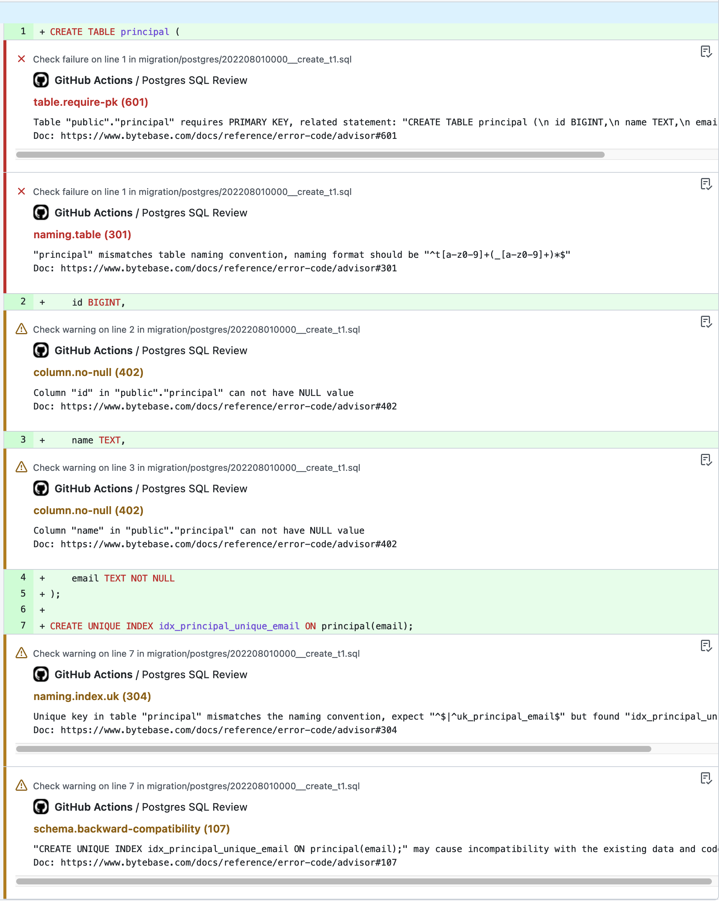

# SQL Review Action

The GitHub Action for SQL Review. Parse and check the SQL statement according to the SQL review rules.

## Usage

Create a file in `.github/workflows/sql-review.yml` in your repository and insert the following content:

```yml
on: [pull_request]

jobs:
  sql-review:
    runs-on: ubuntu-latest
    name: SQL Review
    steps:
      - uses: actions/checkout@v3
      - name: Check SQL
        uses: bytebase/sql-review-action@0.0.1
        with:
          override-file-path: "<Your SQL review rules configuration file path>"
          template-id: "<SQL review rule template id>"
          database-type: "<The database type>"
```

The action will be triggered in any pull request which has SQL files changed. It will call the SQL review service to check if the change is valid according to the SQL review rules.

### About parameters

- `database-type`: **Required**. The database type, should be one of `MYSQL`, `POSTGRES` or `TIDB`.
- `override-file-path`: **Optional**. Your SQL review rules configuration file path. You can configure and generate this file in [Bytebase SQL Review Guide](https://www.bytebase.com/sql-review-guide) page. You can ignore this parameter and only provide the template id if you don't want to customize rules.
- `template-id`: **Optional**. The SQL Review rule template id, should be one of [`bb.sql-review.prod`](https://bytebase.com//sql-review-guide?templateId=bb.sql-review.prod) or [`bb.sql-review.dev`](https://bytebase.com//sql-review-guide?templateId=bb.sql-review.dev). You can ignore this parameter if you provide the `override-file-path` parameter.

## Example

Once you configure the action, you can get these error or warning message based on your SQL review rules:



- Go to the [`./example/`](./example/) folder to see how to configure the workflow and override SQL review rules.
- Go to [bytebase](https://github.com/bytebase/bytebase/tree/main/.github/workflows) for a real example.
